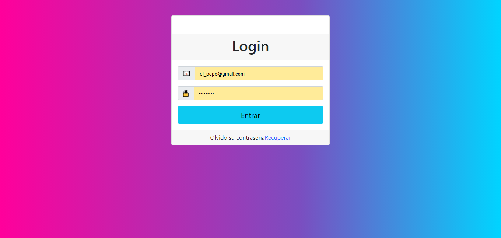
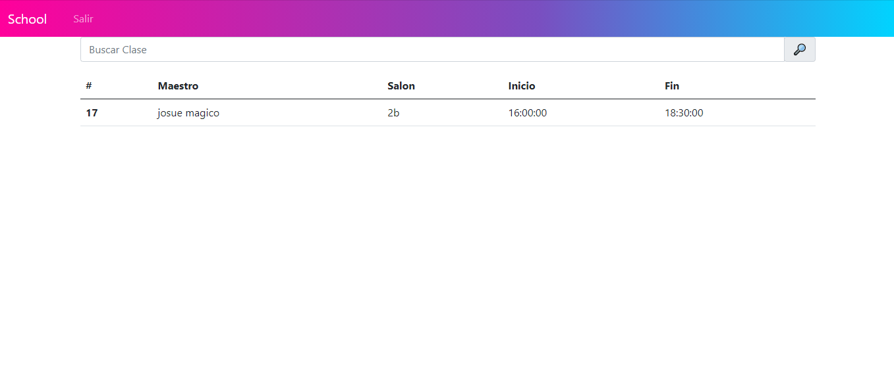
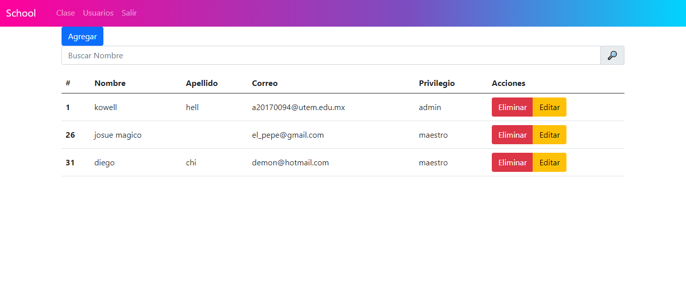
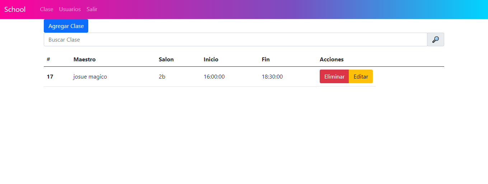

## Login

Escribe usuario y contraseña registrado.

## vista de maesto

En esta parte los maestros podran ver los horarrios.

## CRUD Usuarios

En este apartado podran agregar usuarios, buscar, eleiminar y editar.

## CRUD Clases

En este apartado podran agregar clases, buscar, eleiminar y editar.